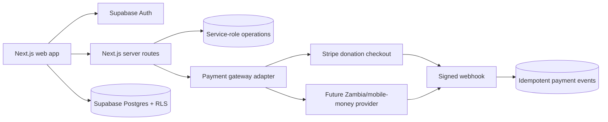

# Architecture and operating model

## Design principles

1. **Public information can degrade gracefully.** The marketing site, demo data and boundary map render without credentials. Authenticated writes require Supabase.
2. **Trust is computed, not claimed.** Outage status is derived from recency, reporter reputation, source and independent confirmations. Provider verification records reviewed evidence but never guarantees performance.
3. **Payments are an adapter.** Orders and donations are ZAP domain records; processor references live in `payments`. This allows Stripe, mobile money, bank settlement or another regulated provider without rewriting marketplace logic.
4. **The database enforces boundaries.** Row-level security prevents client code from reading private requests, proposals, orders and donations belonging to other users.
5. **Precise location is private by default.** Public reporting should use district and approximate area. Exact site information belongs only in an authorized job or organization workflow.

## Runtime flow

## Roles

- **Resident/customer:** report and confirm status, save areas, request services, accept proposals, pay and review completed jobs.
- **Provider:** maintain verification/profile/listings, view eligible open requests, submit proposals and manage orders.
- **NGO/organization:** propose and publish reviewed impact projects and milestone updates.
- **Admin/trust team:** moderate reports, verify organizations/providers, manage disputes and review payment events. Admin actions should be server-only and audited before launch.

## Scaling path

- Cache public district aggregates at the edge while keeping report writes transactional.
- Move confidence aggregation into scheduled SQL/functions and publish snapshots through Realtime.
- Store documents and evidence in private Supabase Storage buckets with signed URLs.
- Add a jobs/queue service for SMS, email, fraud review and webhook retries.
- Partition/archive high-volume report and event tables only after observed scale warrants it.
- Expand province by province; keep district boundaries and data-source provenance versioned.

## Security checklist

- Rotate production keys and isolate preview/production projects.
- Add CAPTCHA and IP/account throttles to reports, auth and quote requests.
- Validate every API payload and re-fetch price/account data server-side.
- Verify webhook signatures and retain unique provider event IDs.
- Encrypt and tightly restrict verification documents.
- Add database tests for every RLS policy before shipping.
- Add immutable admin audit logs and a deletion/export workflow.
